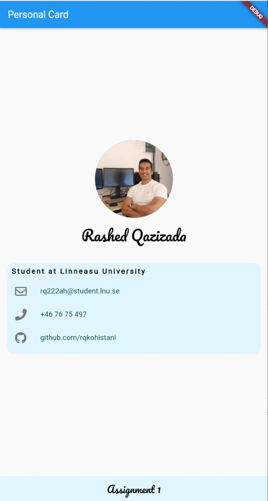
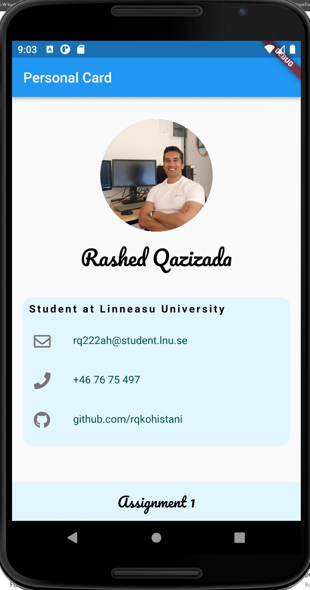

# Personal Card Flutter App

## assignment 1

This is a simple flutter application that creates a personal card with user's details.

## Prerequisites

Before you begin, ensure you have met the following requirements:

* You have installed Flutter SDK. 
* You have a suitable editor for coding (for example, Visual Studio Code).
* You have installed Dart SDK.
* Google Chrome is installed on your machine.

## Running the Personal Card Flutter App

To run and set up the project locally, follow these steps:

1. Clone the repository to your local machine using this command "where flutter sdk is installed": **C:\flutterApps** maybe.
2. Open the project in Visual Studio Code

3. Navigate into the cloned repository's directory:
4. Open terminal and the dependencies for the flutter project:

    ```bash  
    flutter pub get
    ```

5. If you haven't installed any emulators, you can choose Chrome as your target device to run your application. To do this, go to the bottom-right status bar, click on the device selector and choose `Chrome (web-javascript)`.
6.  Navigate to the `lib` directory, right click on `main.dart` and select 'Run without debugging'. A browser window should pop up with the application running.

## If you are totally lost then follow these beginner tutorials

[CODEMY.COM](https://www.youtube.com/watch?v=pTJJsmejUOQ)

## Assignment 1: Personal Card

In this assignment, we want you to create a static Flutter application that shows some information about you. The final result could look something like below.


Yeah, horrible image... That aside, your creation should contain the following:

* An image, possibly of you but that is not a requirement
* A text with a decorative or handwritten font from Google Fonts
* Your (or whatever you do this for) title in bold
* Three rows of information with an icon before it
* 
In addition to this, you could make your image circular and the information on a card, like seen above. But, and this is important, you do not **need** to do something that looks exactly as above -- you are free to make decisions as long as the four points above are met.

## Emulator Information

For this project, I use Nexus 6 emulator. The specifications are as follows:

* Device: Nexus 6
* Size: 5.96"
* Resolution: 1440x2560
* Density: 560 dpi

[](https://www.raspberrypi.com/documentation/microcontrollers/raspberry-pi-pico.html)
[](https://www.raspberrypi.com/documentation/microcontrollers/raspberry-pi-pico.html)
