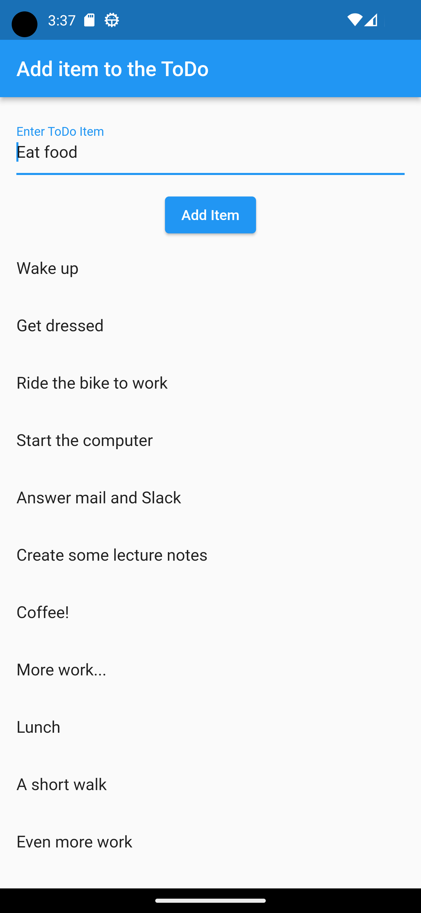
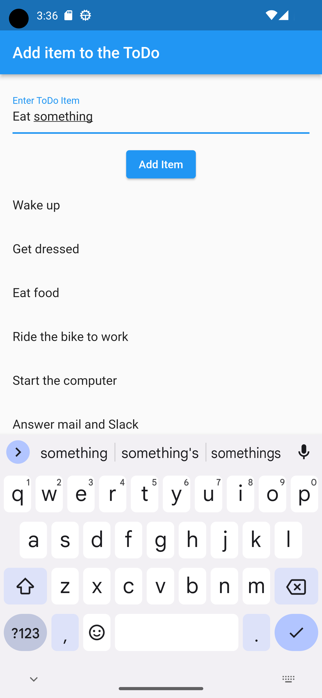

# Assignment 2: ToDo list

## The ToDo list

In this assignment, you are going to create a simple ToDo application. You will not need to make anything of it persistent, that is, no database or saving of data is necessary. The objective is to work with input and lists. See below for an example look at the application.

  
   

The following are the requirements for the application:

- Text can be entered and put in a scrollable list (that is, it should scroll when there is no more room)
- If an item is clicked, it should be removed from the list and the text set into the text field
- Following the above, the new text can be put last on the list

As with the previous assignment, it does not have to look exactly like this. The text input can be below the scrollable list and the colours could be different. The text field could have a nice decoration and you are free to add images and icons where you see fit.

**IMPORTANT!**
Do not forget to run **flutter clean** before handing in.
