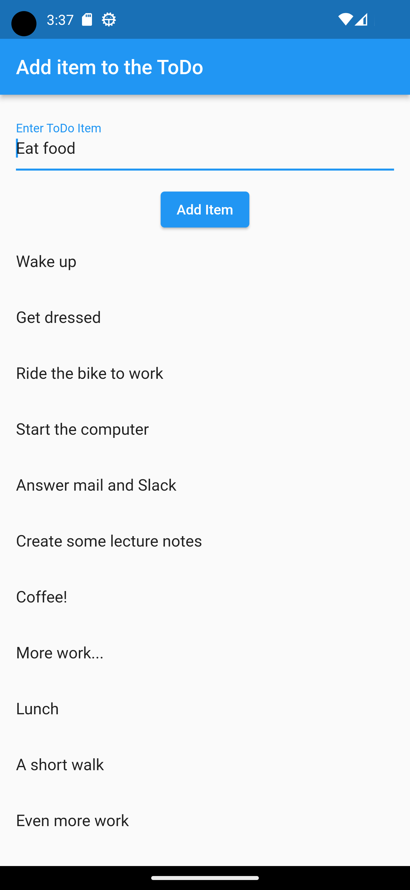
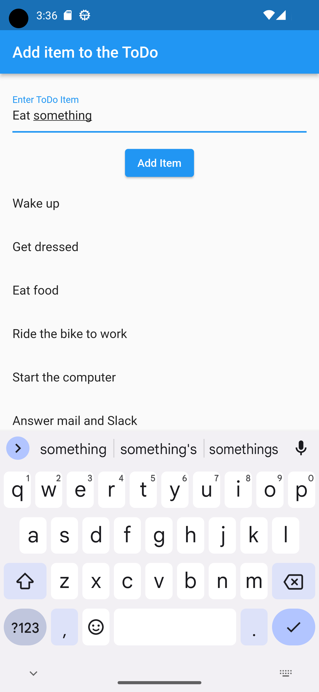
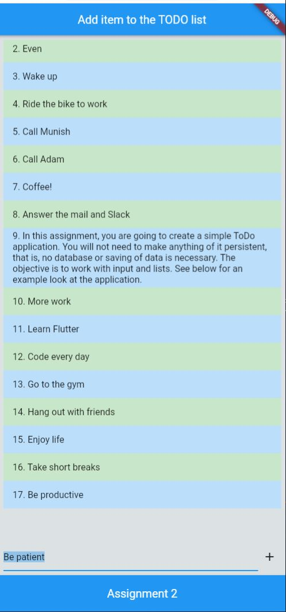
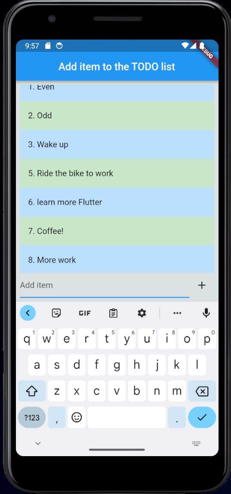

# Assignment 2: ToDo list

This is a simple flutter application that creates a simple ToDo application.

***

## Prerequisites

#### [Assignment 1: The Me card](../assignmentOne/README.md)

***

## The ToDo list

In this assignment, you are going to create a simple ToDo application. You will not need to make anything of it persistent, that is, no database or saving of data is necessary. The objective is to work with input and lists. See below for an example look at the application.

<div style="text-align: center;">
  
   
</div>

***

The following are the requirements for the application:

- Text can be entered and put in a scrollable list (that is, it should scroll when there is no more room)
- If an item is clicked, it should be removed from the list and the text set into the text field
- Following the above, the new text can be put last on the list

As with the previous assignment, it does not have to look exactly like this. The text input can be below the scrollable list and the colours could be different. The text field could have a nice decoration and you are free to add images and icons where you see fit.

**IMPORTANT!**
Do not forget to run **flutter clean** before handing in.

***

## Submission
<!-- TODO: update the photos -->
<div style="text-align: center;">
  
   
</div>

***

## Running the application

To run and set up the project locally, follow these steps:

- Clone the repository to your local machine using this command "where flutter sdk is installed": **C:\flutterApps** maybe.
- Open the project in Visual Studio Code

- Navigate into the cloned repository's directory:
- Open terminal and the dependencies for the flutter project:

    ```bash  
    flutter pub get
    ```

- If you haven't installed any emulators, you can choose Chrome as your target device to run your application. To do this, go to the bottom-right status bar, click on the device selector and choose `Chrome (web-javascript)`.
-  Navigate to the `lib` directory, right click on `main.dart` and select 'Run without debugging'. A browser window should pop up with the application running.

### Emulator Information
For this project, I use the Pixel 3a emulator. The specifications are as follows:

Device: Pixel 3a API 34
Extension Level: 7
Architecture: x86_64

***

## If you are totally lost then follow these beginner tutorials

[CODEMY.COM](https://www.youtube.com/watch?v=pTJJsmejUOQ)
***
